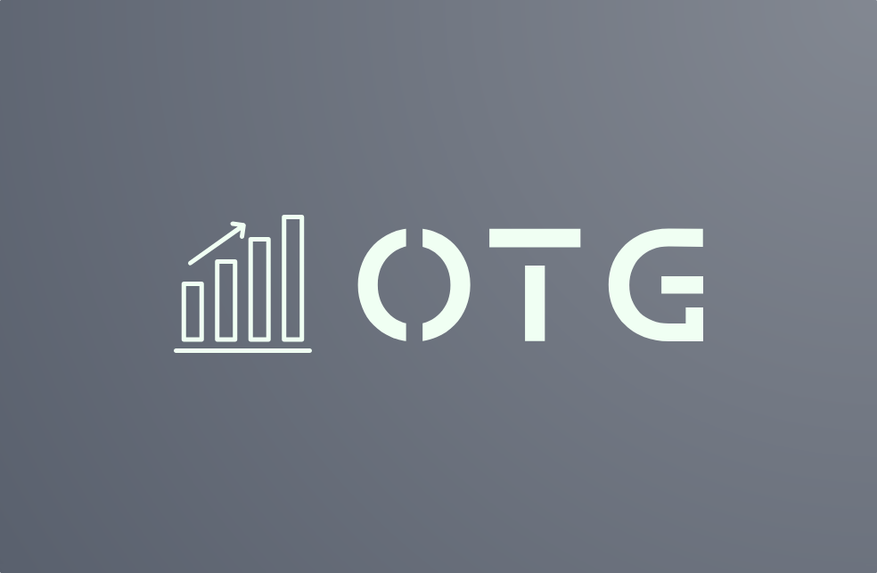

<h1 align="center">OTG</h1>
<p align="center">
  
</p>
> OTG is a team of young people, passionate about programming and keen on sharing their trading experience through their app.

## Project Overview

This project was developed as part of a school assignment by a team of four.  The primary goals of this project include practicing backend development principles, implementing an agile workflow with scrum, and learning collaborative coding practices. The main idea of the project is to give people access to  trading without having to invest anything without experience.

## Team Members

- **Backend Developers:**
  - [Stanislav Radev](https://github.com/SNRadev22) - Backend Developer
  - [Martin Dimitrov](https://github.com/MEDimitrov22) - Backend Developer
  - [Petar Dimitrov](https://github.com/PPDimitrov22) - Backend Developer
- **Scrum Trainer:**
  - [Milko Barev](https://github.com/MSBarev22) - Scrum Master

---

## Technologies Used

- **Languages:** C++
- **Libraries** SFML

## Installation and Setup

1. **Clone the repository**:
   ```bash
   git clone [https://github.com/yourusername/your-repo.git](https://github.com/codingburgas/finance-challenge-otg)
   run the main file
